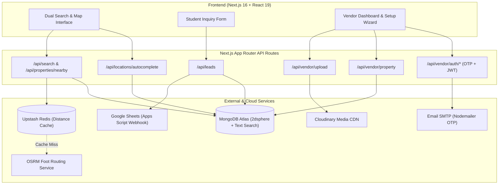
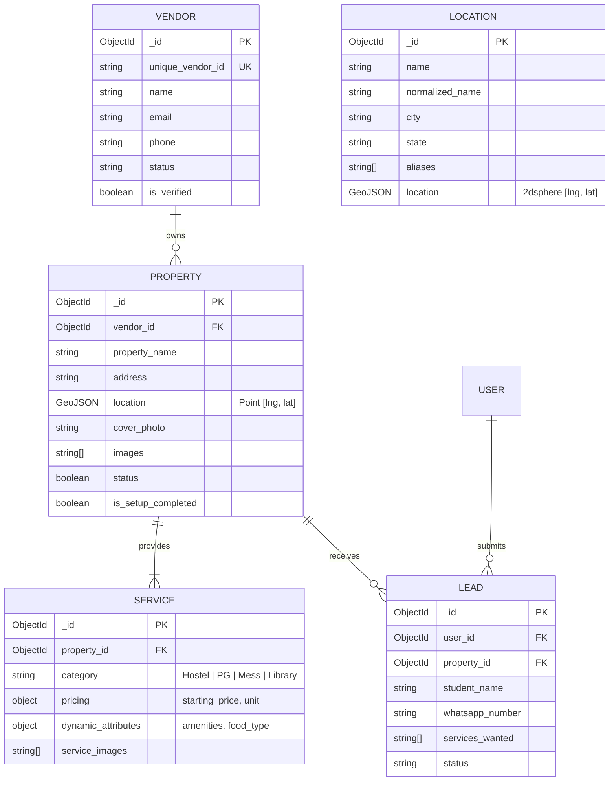

# 🏠 KHM (Kota Hostels & Mess) — Super Search Platform

<div align="center">

[](https://nextjs.org/)
[](https://react.dev/)
[](https://www.typescriptlang.org/)
[](https://tailwindcss.com/)
[](https://www.mongodb.com/)
[](https://upstash.com/)
[](https://cloudinary.com/)
[](https://leafletjs.com/)

**A modern, hyper-local student accommodation and daily essentials discovery platform built specifically for students in Kota, Rajasthan.**

[Live Demo](#) • [Explore Features](#-key-features) • [System Architecture](#-system-architecture) • [Getting Started](#-getting-started) • [API Reference](#-api-endpoints)

</div>

---

## 📖 Table of Contents

- [Overview & The Problem](#-overview--the-problem)
- [Key Features](#-key-features)
- [System Architecture](#-system-architecture)
- [Technology Stack](#-technology-stack)
- [Repository Structure](#-repository-structure)
- [Database Schema Design](#-database-schema-design)
- [Getting Started](#-getting-started)
  - [Prerequisites](#prerequisites)
  - [Installation](#installation)
  - [Environment Setup](#environment-setup)
  - [Database Seeding](#database-seeding)
  - [Running the App](#running-the-app)
- [API Reference](#-api-endpoints)
- [Security & Performance Engineering](#-security--performance-engineering)
- [Troubleshooting & Gotchas](#-troubleshooting--engineering-notes)
- [Contributing](#-contributing)
- [License](#-license)

---

## 🎯 Overview & The Problem

Every year, over **200,000+ students** travel to Kota, Rajasthan to prepare for competitive examinations like IIT-JEE and NEET. Finding safe, affordable, and conveniently located accommodation poses significant challenges:
- **Misleading Distance Claims**: Unregulated local brokers frequently advertise hostels as "just 2 minutes from coaching", while the actual walking commute is 15–20 minutes.
- **Fragmented Offerings**: Students must search separately for Hostels/PGs, hygienic Mess services, and quiet 24x7 study libraries.
- **Unverified Listings & Hidden Costs**: Lack of standardized pricing, transparent amenities, and high brokerage fees.

### 💡 The KHM Solution

**KHM (Kota Hostels & Mess)** provides an all-in-one search and discovery engine tailored for Kota's student ecosystem:
1. **Real Foot-Distance Engine**: Automatically computes the exact walking distance (in meters) and commute duration (in minutes) from any student's coaching institute (e.g., Allen Sankalp, Motion, Resonance) to verified hostels and PGs.
2. **Multi-Service Aggregation**: A single property can list multiple integrated services—Boys/Girls Hostel, PG, Mess, and Digital Library.
3. **Dedicated Vendor Self-Service Portal**: Hostel and business owners easily onboard their properties, manage photos, configure transparent pricing, and receive verified student leads directly.
4. **Instant Lead Dispatch**: Student inquiries automatically sync in real-time to Google Sheets via serverless webhooks for operations management.

---

## ✨ Key Features

### 🔍 1. Dual Search & Geospatial Autocomplete
- **Landmark & Institute Search**: Type any coaching campus (e.g., *Allen Samyak*, *Motion Dropper Campus*, *City Mall*) to find accommodations within walking radius.
- **Fuzzy Autocomplete**: MongoDB `$search` aggregation with compound fuzzy matching on property names, locations, and aliases.
- **Category Quick Filters**: Instantly toggle between **Boys Hostel**, **Girls Hostel**, **Single PG**, **Double PG**, **Mess/Tiffin**, and **Library**.

### 🚶‍♂️ 2. Walking Distance & Duration Engine
- Powered by the **OSRM Foot-Routing API** (`/route/v1/foot/`) to calculate true pedestrian walking paths (avoiding vehicle highway detours).
- **Sub-Millisecond Response Caching**: Responses are cached using **Upstash Redis** (`distance:origin_lat,origin_lng:dest_lat,dest_lng`).
- **Mathematical Fallback**: Automatically falls back to the **Haversine Formula** if external routing networks encounter downtime.

### 🗺️ 3. Interactive Geospatial Maps
- Integrated **Leaflet** map with custom markers for properties, coaching hubs, and student landmarks.
- **SSR-Safe Architecture**: Uses `next/dynamic` with `ssr: false` to ensure zero hydration mismatches or `"window is not defined"` runtime crashes.

### 🏢 4. Comprehensive Vendor Portal
- **4-Step Interactive Onboarding Wizard** (`VendorSetupWizard.tsx`):
  - Step 1: Property Details (Name, Address, Kota Area selection).
  - Step 2: Precise Map Geocoding (Interactive pin-drop to set latitude/longitude coordinates).
  - Step 3: Service Catalog & Pricing (Select categories, starting rent, room amenities).
  - Step 4: Visual Confirmation & Listing Review.
- **Passwordless Authentication**: Secure 6-digit Email OTP login via **Nodemailer** + HTTP-Only **JWT** session cookies.
- **Verification State Control**: Properties are kept safely unlisted until verified by the KHM quality inspection team.

### 📸 5. Client-Side Optimized Media Pipeline
- **Smart Compression**: Utilizes `browser-image-compression` on the client to convert photos to high-efficiency **WebP** (< 500KB) before transmission.
- **Cloudinary CDN Integration**: Uploads are organized into vendor-scoped folders (`khm_properties/{vendor_id}/`).
- **Automated Orphan Image Cleanup**: Deletes orphaned assets if a vendor removes an image prior to saving.

### 📋 6. Instant Student Lead Dispatch
- Interactive modal for students to submit inquiries with room preferences and WhatsApp contact.
- Asynchronous POST webhook delivery to **Google Apps Script** / Google Sheets with automatic retry handling.

---

## 🏗️ System Architecture



---

## 💻 Technology Stack

| Layer | Technologies |
|---|---|
| **Framework** | [Next.js 16 (App Router)](https://nextjs.org/) |
| **UI Library** | [React 19](https://react.dev/), [TypeScript](https://www.typescriptlang.org/) |
| **Styling** | [Tailwind CSS v4](https://tailwindcss.com/), [shadcn/ui](https://ui.shadcn.com/), [tw-animate-css](https://www.npmjs.com/package/tw-animate-css) |
| **Icons** | [Lucide React](https://lucide.dev/) |
| **State Management** | [Zustand](https://zustand-demo.pmnd.rs/) |
| **Maps & Geospatial** | [Leaflet](https://leafletjs.com/), [React-Leaflet](https://react-leaflet.js.org/), `@react-google-maps/api` |
| **Database** | [MongoDB Atlas](https://www.mongodb.com/) with [Mongoose ODM](https://mongoosejs.com/) |
| **Spatial Indexing** | MongoDB GeoJSON `2dsphere` & Atlas Search |
| **Caching Layer** | [Upstash Redis](https://upstash.com/) (Serverless REST client) |
| **Media CDN** | [Cloudinary](https://cloudinary.com/) with `browser-image-compression` |
| **Authentication** | Custom Passwordless Email OTP + [jsonwebtoken (JWT)](https://www.npmjs.com/package/jsonwebtoken) |
| **Transactional Email** | [Nodemailer](https://nodemailer.com/) |
| **Operations Integration** | Google Apps Script Webhooks (Google Sheets) |

---

## 📂 Repository Structure

```
KHM/
├── app/                                 # Next.js App Router
│   ├── api/                             # Serverless Backend Endpoints
│   │   ├── admin/                       # Admin endpoints (leads, vendors)
│   │   ├── autocomplete/                # Autocomplete search endpoint
│   │   ├── leads/                       # Student inquiry lead capture & webhook
│   │   ├── locations/autocomplete/      # Geospatial location autocomplete ($search)
│   │   ├── properties/nearby/           # $geoNear spatial distance queries
│   │   ├── search/                      # Core search aggregation engine
│   │   └── vendor/                      # Vendor authentication, property & uploads
│   ├── property/[id]/                   # Dynamic property detail page
│   ├── search/                          # Search results with interactive map & filters
│   ├── vendor/                          # Vendor Portal (Login, Register, Dashboard)
│   ├── layout.tsx                       # Root layout (Navbar, Footer, Providers)
│   └── page.tsx                         # Landing page with hero & dual search bar
├── components/                          # Reusable UI & Business Components
│   ├── ui/                              # shadcn/ui components (buttons, dialogs, inputs)
│   ├── DualSearchBar.tsx                # Location + Keyword search with instant popups
│   ├── FilterMenu.tsx                   # Category, price range, and amenity filters
│   ├── Footer.tsx                       # Footer with Kota landmarks & quick links
│   ├── LeadForm.tsx                     # Modal for student inquiry submission
│   ├── LeafletMap.tsx                   # SSR-safe interactive map component
│   ├── Navbar.tsx                       # Header with navigation & vendor action buttons
│   ├── PropertyCard.tsx                 # Property card with walking badges & amenities
│   ├── QuickCategories.tsx              # Category pills for rapid filtering
│   └── VendorSetupWizard.tsx            # 4-step property creation wizard
├── lib/                                 # Shared Utilities & Clients
│   ├── cloudinary.ts                    # Cloudinary SDK client configuration
│   ├── distanceService.js               # OSRM foot-routing, Redis cache & Haversine
│   ├── imageUtils.js                    # Client-side image compression helpers
│   ├── jwt.js                           # JWT token signing & verification utilities
│   ├── mailer.js                        # Nodemailer OTP email dispatcher
│   ├── mongodb.js                       # Cached MongoDB connection pool with DNS fix
│   ├── redis.js                         # Upstash Redis REST client initialization
│   ├── store.ts                         # Zustand client-side global state store
│   └── utils.ts                         # Tailwind CSS merge utilities (`cn`)
├── models/                              # Mongoose Database Schemas
│   ├── DistanceCache.js                 # Fallback database distance cache
│   ├── Entity.js                        # Educational institutes & landmarks
│   ├── Lead.js                          # Student leads & inquiry history
│   ├── Location.js                      # GeoJSON locations with 2dsphere indexing
│   ├── Property.js                      # Core accommodation properties
│   ├── Service.js                       # Linked services (Hostel, PG, Mess, Library)
│   ├── User.js                          # Student user records
│   └── Vendor.js                        # Verified property vendor accounts
├── public/                              # Static public assets and icons
├── scripts/                             # Utility & Database Seeding Scripts
│   ├── seedKotaComprehensive.js         # Real Kota coordinates & properties seed
│   └── seedVendor.js                    # Vendor test accounts seed script
├── .env.example                         # Environment configuration template
├── .gitignore                           # Git ignore rules protecting all credentials
├── package.json                         # Project dependencies and npm scripts
└── tsconfig.json                        # TypeScript configuration
```

---

## 🗄️ Database Schema Design



---

## 🚀 Getting Started

### Prerequisites

Ensure you have the following installed on your local machine:
- **Node.js**: `v18.18.0` or later (Node.js 20+ recommended)
- **npm** or **pnpm**
- **MongoDB**: A free MongoDB Atlas cluster (M0 or higher) with Atlas Search enabled
- **Upstash Redis**: A free Upstash Redis database
- **Cloudinary**: A free Cloudinary account for media storage

### Installation

1. **Clone the repository**:
   ```bash
   git clone https://github.com/ajay826931/KHM.git
   cd KHM
   ```

2. **Install project dependencies**:
   ```bash
   npm install
   ```

### Environment Setup

Create your local environment file by copying the provided example template:

```bash
cp .env.example .env.local
```

Open `.env.local` and populate your credentials:

```ini
# MongoDB Connection URI
MONGODB_URI="mongodb+srv://<username>:<password>@cluster0.example.mongodb.net/khm_database?retryWrites=true&w=majority"

# Cloudinary Credentials
CLOUDINARY_CLOUD_NAME="your_cloud_name"
CLOUDINARY_API_KEY="your_api_key"
CLOUDINARY_API_SECRET="your_api_secret"

# Upstash Redis
UPSTASH_REDIS_REST_URL="https://your-upstash-redis-url.upstash.io"
UPSTASH_REDIS_REST_TOKEN="your_upstash_redis_token"

# Google Sheets Webhook (Optional for Lead Forwarding)
GOOGLE_SHEET_WEBHOOK_URL="https://script.google.com/macros/s/your-app-script-id/exec"

# JWT Secret for Vendor Sessions
JWT_SECRET="your_long_random_jwt_secret_key"

# Email SMTP for Vendor OTP Login
EMAIL_USER="your-email@gmail.com"
EMAIL_PASS="your-gmail-app-password"
EMAIL_FROM="your-email@gmail.com"
```

> **Note**: `.env.local` is listed in `.gitignore` and must **never** be committed to version control.

### Database Seeding

To immediately populate the database with realistic Kota student hubs (Allen, Motion, Resonance across *Jawahar Nagar*, *Landmark City*, *Rajeev Gandhi Nagar*, *Vigyan Nagar*, etc.) along with 20+ hostels and mess services:

```bash
node scripts/seedKotaComprehensive.js
```

### Running the App

Start the development server:

```bash
npm run dev
```

Visit [http://localhost:3000](http://localhost:3000) in your browser.

- **Student Discovery**: [http://localhost:3000](http://localhost:3000)
- **Search & Map**: [http://localhost:3000/search](http://localhost:3000/search)
- **Vendor Portal**: [http://localhost:3000/vendor/login](http://localhost:3000/vendor/login)
- **Vendor Dashboard**: [http://localhost:3000/vendor/dashboard](http://localhost:3000/vendor/dashboard)

---

## 📡 API Endpoints

### 1. Public Discovery & Search

| Method | Endpoint | Description |
|---|---|---|
| `GET` | `/api/locations/autocomplete?q={query}` | Fuzzy autocomplete for landmarks & coaching campuses |
| `GET` | `/api/properties/nearby?lat={lat}&lng={lng}&radius={m}` | Returns accommodations sorted by `$geoNear` distance |
| `GET` | `/api/search?q={query}&category={type}&budget={max}` | Full-text and filtered accommodation search |
| `POST` | `/api/leads` | Capture student lead and trigger Google Sheets webhook |

### 2. Vendor Portal & Management

| Method | Endpoint | Description |
|---|---|---|
| `POST` | `/api/vendor/auth/send-otp` | Generate and email 6-digit verification OTP |
| `POST` | `/api/vendor/auth/verify-otp` | Verify OTP and set secure HTTP-only JWT cookie |
| `POST` | `/api/vendor/auth/logout` | Clear vendor authentication session |
| `GET` | `/api/vendor/property` | Fetch authenticated vendor's property & services |
| `PATCH` | `/api/vendor/property` | Synchronize property profile, coordinates & service catalog |
| `POST` | `/api/vendor/upload` | Stream compressed media to Cloudinary CDN |
| `DELETE` | `/api/vendor/upload` | Remove orphaned image asset from Cloudinary |

---

## 🛡️ Security & Performance Engineering

1. **Zero Public PII**:
   - Vendor personal phone numbers, KYC details, and verification documents are never exposed in public search responses.
2. **Stateless HTTP-Only JWT**:
   - Vendor sessions are stored in HTTP-Only, SameSite cookies to protect against Cross-Site Scripting (XSS).
3. **Client-Side Image Optimization**:
   - Pre-compression using WebP encoding ensures fast uploads even on constrained mobile connections and prevents serverless memory exhaustion.
4. **Resilient Two-Tier Distance Architecture**:
   - Upstash Redis caches OSRM foot routing computations. If external networks experience latency, the system automatically falls back to mathematical Haversine calculation without user interruption.
5. **Non-Blocking Webhook Forwarding**:
   - Lead submission guarantees a responsive 200 OK to the student even if external third-party webhooks (Google Sheets) encounter network retries.

---

## 🔧 Troubleshooting & Engineering Notes

### 1. MongoDB DNS SRV Resolution on Windows
If encountering `querySrv ECONNREFUSED` with MongoDB Atlas on certain local ISP networks, the connection manager (`lib/mongodb.js`) includes a built-in DNS resolver fallback using Google and Cloudflare DNS (`8.8.8.8`, `1.1.1.1`).

### 2. Leaflet Map `"window is not defined"` SSR Crash
Leaflet requires direct access to browser DOM APIs (`window`, `navigator`). In Next.js App Router, all map components are dynamically imported with `{ ssr: false }`:
```tsx
const LeafletMap = dynamic(() => import("@/components/LeafletMap"), {
  ssr: false,
  loading: () => <MapLoadingSkeleton />
});
```

### 3. MongoDB 2dsphere Spatial Indexing
The `Property` and `Location` schemas require a 2dsphere index on the `location` field. The seeding script (`scripts/seedKotaComprehensive.js`) automatically ensures this index is active.

---

## 🤝 Contributing

Contributions, feedback, and feature requests are welcome!

1. Fork the Project.
2. Create your Feature Branch (`git checkout -b feature/AmazingFeature`).
3. Commit your Changes (`git commit -m 'feat: Add AmazingFeature'`).
4. Push to the Branch (`git push origin feature/AmazingFeature`).
5. Open a Pull Request.

---

## 📄 License

This project is licensed under the **MIT License** — see the [LICENSE](LICENSE) file for details.

---

<div align="center">
Made with ❤️ for the student community of Kota, Rajasthan.
</div>
